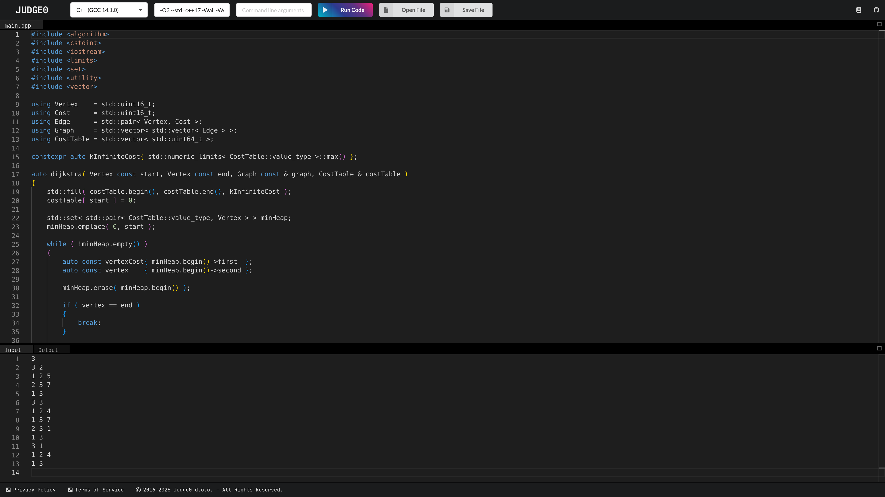
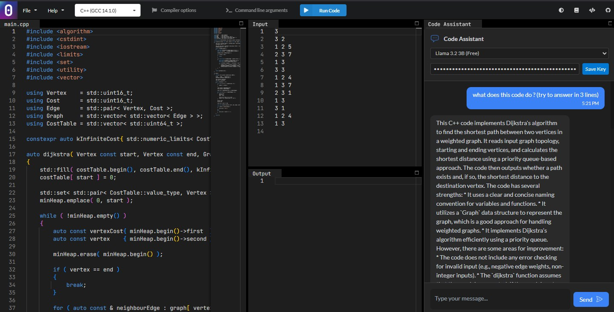

# Judge0 IDE - AI Enhanced Version

[](https://ide.judge0.com)

[](https://github.com/judge0/ide/blob/master/LICENSE)
[](https://github.com/judge0/ide/releases)
[](https://github.com/judge0/ide/stargazers)

<a href="https://www.producthunt.com/posts/judge0-ide" target="_blank"></a>

## About
[**Judge0 IDE**](https://ide.judge0.com) is a free and open-source online code editor that allows you to write and execute code from a rich set of languages. It's perfect for anybody who just wants to quickly write and run some code without opening a full-featured IDE on their computer. Moreover, it is also useful for teaching and learning or just trying out a new language.

Judge0 IDE is using [**Judge0**](https://ce.judge0.com) for executing the user's source code.

Visit https://ide.judge0.com, and enjoy happy coding. :)

🔗 **This project is based on the original [Judge0 IDE repository](https://github.com/judge0/ide).**  

---

## AI Chat Assistant (New Feature 🚀)
This fork enhances the **Judge0 IDE** experience by integrating an **AI-powered coding assistant**. The assistant helps users with:
- **Real-time programming support** by answering coding questions.
- **Code debugging assistance** by analyzing user input/output.
- **Multi-model AI selection** (Llama 3, Gemini 2.0, DeepSeek, and Qwen).
- **Persistent API key storage** for seamless AI interactions.

[](https://ide.judge0.com)

This feature is powered by the **OpenRouter API**, providing low-latency responses while maintaining a free-tier option.

---

## How to Run Locally 🖥️

You can run this **AI-enhanced Judge0 IDE** on your local machine by following these steps:

```sh
# Clone the repository
git https://github.com/ahmedbellaaj10/codex.git
cd codex

# Start a local server
python3 -m http.server 8000

```

Once the server is running, open http://localhost:8000 in your browser to start using the IDE.

## Community
Do you have a question, feature request, or something else on your mind? Or do you want to follow Judge0 news?

* [Subscribe to Judge0 newsletter](https://subscribe.judge0.com)
* [Join our Discord server](https://discord.gg/GRc3v6n)
* [Watch asciicasts](https://asciinema.org/~hermanzdosilovic)
* [Report an issue](https://github.com/judge0/judge0/issues/new)
* [Contact us](mailto:contact@judge0.com)
* [Schedule an online meeting with us](https://meet.judge0.com)

---

## Author and Contributors
Judge0 IDE was created by [Herman Zvonimir Došilović](https://github.com/hermanzdosilovic). This AI-enhanced version was developed by **[Your Name]**, building on top of the original IDE to provide AI-driven coding assistance.

Thanks a lot to all [contributors](https://github.com/judge0/ide/graphs/contributors) for their contributions to this project.

---

## License
Judge0 IDE is licensed under the [MIT License](https://github.com/judge0/ide/blob/master/LICENSE).
